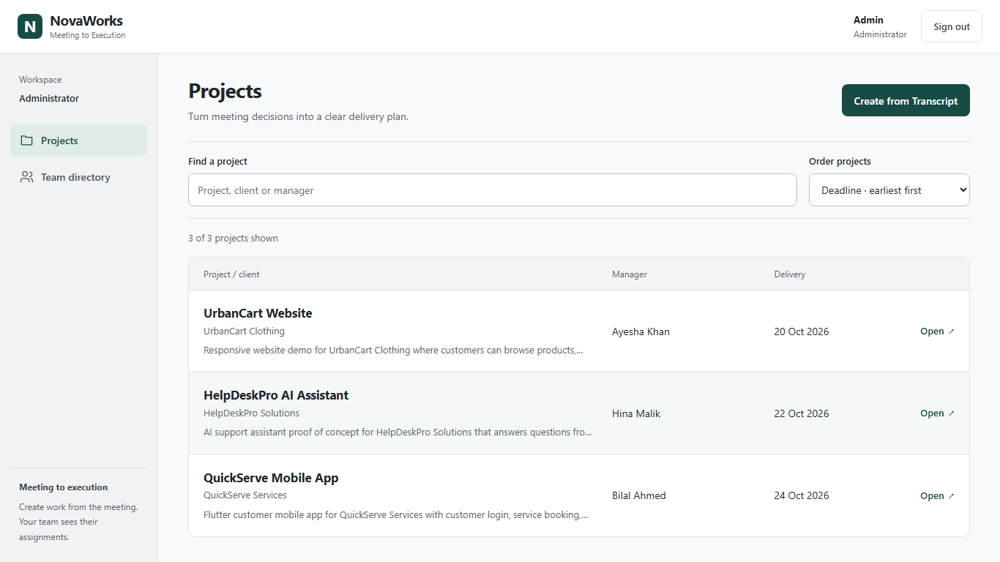
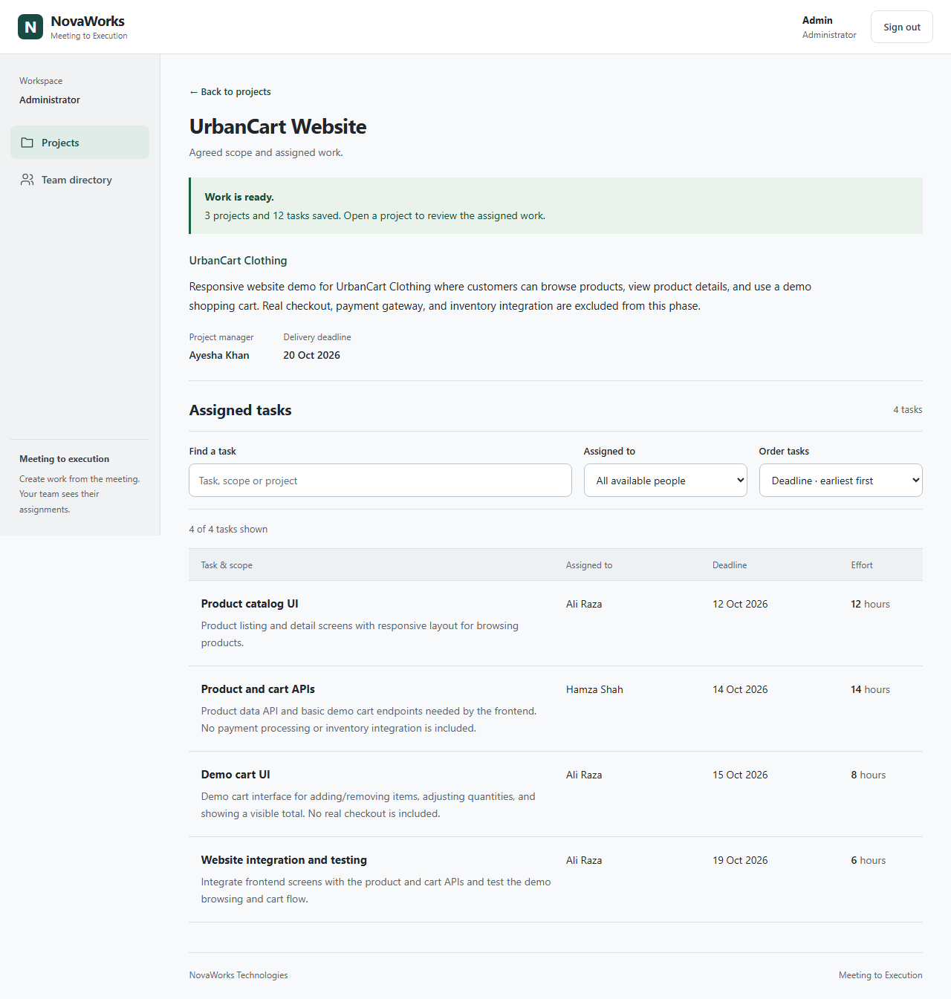
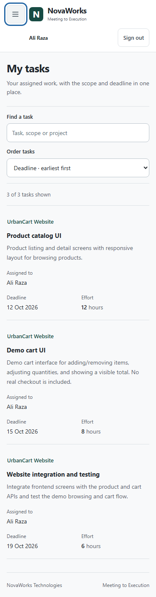
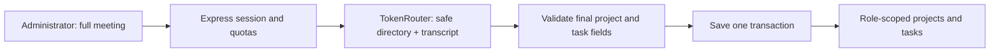

# NovaWorks — Meeting to Execution

Turn a meeting's final decisions into saved projects, tasks, owners, deadlines and effort estimates.

[](https://github.com/Aizaz-Noor/Nova-Works/actions/workflows/verify.yml)


**[Try the live demo](https://nova-works-zeta.vercel.app)** · **[Watch the captioned walkthrough](docs/assets/novaworks-demo.mp4)** · **[Audit and improvements](docs/PUBLIC_DEMO_REPORT.md)**

NovaWorks helps an administrator move from meeting notes to assigned work without entering every project and task separately. A server-side AI request reads the full meeting and a safe team directory. The server checks the result, saves the complete batch together, and shows each person only their permitted work.

Built by Code Nomads for the Infinity Hack '26 AI Project Manager challenge, then improved as a portfolio project. We missed the event submission deadline and did not win. The current deployment, audit fixes and presentation improvements are post-event work.

The current interface adapts to laptop windows and mobile: compact navigation, readable task rows, keyboard recovery and Reduced Motion support. [Responsive release and evidence](docs/RESPONSIVE_RELEASE.md) · [Documentation index](docs/README.md).

## Take a look



| Assigned work | On a narrow screen |
| --- | --- |
|  |  |

The captioned video records the real application with fictional accounts in an isolated local database. Its provenance, extraction/replay disclosure and editing details are in [the demo guide](docs/SOCIAL_DEMO.md). [Download the vertical social version](docs/assets/novaworks-demo-vertical.mp4). No social posts have been published automatically.

## Try it in two minutes

Open the live demo. Choose a role to fill its credentials, then select **Sign in**.

| Role | Email | What you can explore |
| --- | --- | --- |
| Administrator | `admin@novaworks.example` | Projects, directory, transcript creation |
| Project manager | `ayesha@novaworks.example` | Ayesha's assigned projects and their tasks |
| Developer | `ali@novaworks.example` | Ali's own tasks and related projects |

All fictional demo passwords are **`Demo123!`**. This is a shared public demonstration; use fictional sample meetings, not private business information.

1. As administrator, choose **Create from Transcript → Load sample meeting → Create projects and tasks**.
2. A new successful sample batch has three projects and twelve tasks. An already saved meeting reuses its original batch; the success notice tells you which happened.
3. Search **UrbanCart**, open the project and inspect its manager, deadline and task estimates.
4. Sign out and try Ayesha or Ali to see the access boundaries.

The shared workspace may contain other demo projects. Counts for the sample batch do not describe the entire workspace. A fresh extraction uses provider credits; saved replay makes no new model call.

## Features

- AI extraction of final decisions, including later corrections and rejected scope.
- Whole-batch validation of users, roles, dates, task descriptions and positive hours.
- Atomic saves and duplicate-safe replay of an identical meeting.
- Cookie sessions with server-enforced administrator, manager and developer access.
- Project search by project/client/manager and ordering by name or deadline.
- Task search, authorized assignee filters and deadline ordering.
- Read-only team directory with search and role filtering.
- Persistent SQLite locally or Supabase PostgreSQL on the hosted demo.
- Responsive screens, keyboard focus, loading, correction and recovery states.

## Run locally

Install **Node.js 24** and Git. These commands are PowerShell examples; use `npm` instead of `npm.cmd` on macOS/Linux.

```powershell
git clone https://github.com/Aizaz-Noor/Nova-Works.git
cd Nova-Works
npm.cmd ci --prefix backend
npm.cmd ci --prefix app/client
npm.cmd run build --prefix app/client
Copy-Item backend/.env.example backend/.env
```

Edit `backend/.env`. Set a private random `SESSION_SECRET` of at least 32 characters. Keep `FRONTEND_ORIGIN=http://127.0.0.1:3001` and `NODE_ENV=development` for local HTTP. Leave `DATABASE_URL` empty to use SQLite. Set your own authorized server-only `TOKENROUTER_API_KEY` to enable fresh AI extraction; login and browsing do not need that key.

```powershell
npm.cmd run db:init --prefix backend
npm.cmd run seed --prefix backend
npm.cmd start --prefix backend
```

Keep the terminal open and visit **http://127.0.0.1:3001/**. One Express server serves both the built frontend and API. The database is `backend/data/novaworks.sqlite`; preserve it and your session secret across restarts. Seeding again does not duplicate accounts or erase projects.

For frontend development, run `npm.cmd run dev --prefix app/client`, set `FRONTEND_ORIGIN=http://127.0.0.1:5173`, restart the backend, and use that exact URL. The Vite server proxies `/api` to port 3001. The explicitly labeled `/?preview=1` design preview is static and cannot authenticate, run AI or save work.

## Configuration and deployment

Private values belong in `backend/.env` locally or the host's secret manager. Never put them in `VITE_*` variables, screenshots or Git.

| Variable | Purpose |
| --- | --- |
| `SESSION_SECRET` | Private session signing secret, at least 32 characters |
| `FRONTEND_ORIGIN` | Exact browser origin, with no path or trailing slash |
| `TOKENROUTER_API_KEY` | Server-only provider credential |
| `TOKENROUTER_MODEL` | Tested model: `deepseek/deepseek-v4-flash-0731` |
| `TOKENROUTER_BASE_URL` | Defaults to `https://api.tokenrouter.com/v1` |
| `DATABASE_URL` | Optional private PostgreSQL connection; empty selects SQLite |
| `DATABASE_PATH` | SQLite path, relative to `backend` |
| `REQUIRE_POSTGRES` | Set `1` on ephemeral hosted filesystems |
| `NODE_ENV` / `TRUST_PROXY` | Production secure cookies / trusted HTTPS ingress |
| `AI_DAILY_LIMIT` / `LOGIN_ATTEMPT_LIMIT` | Persistent request quotas; defaults 20 / 10 |

The current live demo uses **Vercel + Supabase PostgreSQL**. Supabase provides database storage, not browser-side authentication. Express checks permissions; the private database schema denies access to public browser roles. TLS verification remains enabled.

- [Vercel setup and verification](docs/deployment/VERCEL.md)
- [Supabase configuration](docs/deployment/SUPABASE.md)
- [Optional Docker deployment](docs/deployment/DOCKER.md) — container execution is not verified here

## How it works



The prompt treats the transcript as source data, uses supplied employee IDs, and prefers final agreed corrections. Structural validation cannot guarantee that an AI model understood every sentence correctly. Incomplete or invalid results are returned for correction rather than partly saved.

Stack: React 19, Vite 6, JavaScript/plain CSS, Node.js 24, Express 5, `express-session`, built-in SQLite or `pg`, TokenRouter. No custom training, browser API key or Firebase/Supabase Auth migration.

## Verify it yourself

```powershell
npm.cmd run test:all --prefix backend
npm.cmd run build
node backend/scripts/verify-deployed.js
```

The backend suite covers authentication, role restrictions, validation, rollback, persistence, quotas, concurrency and provider failures. The public verifier checks the complete saved-sample flow and direct access denials. It makes a fresh AI call only if that sample is not already saved. [Testing guide](docs/TESTING.md) · [Detailed audit, fixes and results](docs/PUBLIC_DEMO_REPORT.md).

GitHub Actions runs backend tests, production build and dependency audits on pushes to `main` and pull requests. A passing build is not a substitute for the browser and data-flow checks documented in the audit.

## Scope and limitations

This is a portfolio demonstration with shared fictional credentials, not a private company workspace. There is no signup, password reset, user administration, task editing, progress tracking, billing or cost calculation. Provider availability and semantic accuracy are not guaranteed. Full accessibility conformance and Docker runtime are not claimed. Before using real data, replace demo accounts, rotate previously exposed private credentials and review the restricted database/runtime access model.

## Team and acknowledgments

- **Aizaz** — product direction, UI/UX, frontend, integration and repository ownership.
- **Abdullah** — delivered the original backend branch, authentication, storage, extraction adapter, validation and tests.
- **Abdul Basit** — team member assigned backend/AI support; specific additional delivered code is not independently attributed here.

Thanks to the Infinity Hack '26 organizers for the challenge and fictional company/team scenario. Built with the open-source projects named above, Supabase, Vercel and TokenRouter. Codex assisted implementation, testing and documentation. Dependency licenses remain with their respective authors.

[90-second script and storyboard](docs/SOCIAL_DEMO.md) · [Social post drafts](docs/SOCIAL_POSTS.md) · [Earlier event recording and submission history](docs/history/SUBMISSION.md)